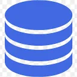
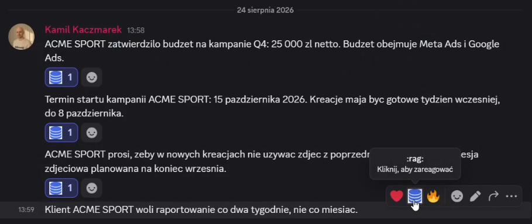
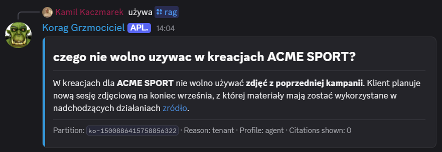
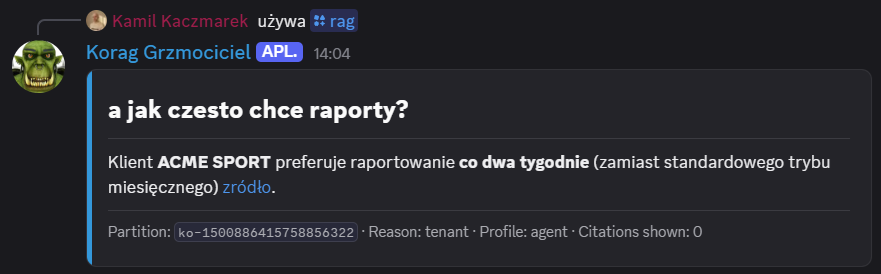
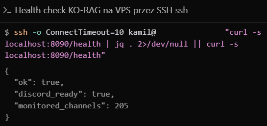
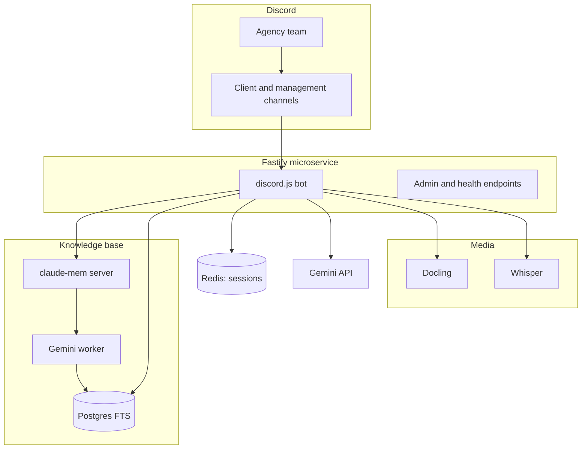

https://github.com/user-attachments/assets/5e1e8401-db24-43a7-b39d-06771f072b29

<h1 align="center">KO-RAG</h1>

<h3 align="center">An agency knowledge base on Discord. A  :rag: reaction saves important messages, the /rag command answers with links to sources.</h3>

<p align="center">
  
  
  
  
  
  
  
  
</p>

---

## Table of Contents

- [About](#about)
- [Screenshots](#screenshots)
- [Source Code](#source-code)
- [Tech Stack](#tech-stack)
- [Features](#features)
- [Architecture](#architecture)
- [Statistics](#statistics)
- [Contact](#contact)

---

## About

In a marketing agency, client knowledge drowns in Discord threads. Covering for a teammate or answering "what did the client write two weeks ago" meant scrolling through hundreds of messages. The team kept talking on Discord. What was missing was memory you can ask.

KO-RAG closes that gap. A message marked with a `:rag:` reaction  goes into the knowledge base: text, voice messages (turned into text), documents and screenshots. Ask with `/rag` and you get an answer with citations: message link, author, channel. You can dig deeper in the same conversation for 90 minutes.

In production since May 2026. Each client channel only sees its own data. The management channel asks across the whole agency. The bot runs on a server, checks its own health and sends an e-mail alert when something fails.

---

## Screenshots

| Saved to the base by reaction | Answer with links to sources |
|:---:|:---:|
|  |  |

| Follow-up in the same conversation | Service health and alerts |
|:---:|:---:|
|  |  |

> **Note:** the screenshots come from a test channel and show a fictional client (ACME SPORT). No production or client data is published.

---

## Source Code

The code is private and confidential (internal agency system). This repository documents the project: description, architecture, and screenshots of it in action.

---

## Tech Stack

### Microservice

```
Node.js 22 + Fastify 5      // API, webhooks, admin endpoints
TypeScript 5 (strict)       // 58 source files, fully typed
discord.js 14               // reactions, slash commands, follow-up sessions
Zod                         // config validation
```

### Knowledge Base (RAG)

The heart of the system is the open-source [claude-mem](https://github.com/thedotmack/claude-mem): it accepts events, a Gemini worker turns them into observations, and Postgres FTS handles search.

```
claude-mem server           // events, Gemini worker, observations
PostgreSQL FTS              // search + citation join (link, author, channel)
Gemini API                  // answers, query splitting, function calling
Redis                       // follow-up sessions (90 min TTL) and agent mode
```

### Media and Documents

```
faster-whisper (medium)     // voice message transcription
Docling                     // PDF, DOCX, XLSX and images to markdown
Google Drive export         // spreadsheet and document links
```

### Operations

```
Docker Compose on a VPS     // no public ports, health on 127.0.0.1
cron + SMTP2GO              // health checks and e-mail alerts
Notion API                  // client census on the management channel
Google Directory            // optional meeting schedule
```

---

## Features

### Saving to the knowledge base

- **`:rag:` reaction**  - the only way in. No reaction, no save. The team chooses what is worth remembering
- **Whole thread at once** - reacting to a thread starter saves the whole thread (up to 500 messages). No need to click every reply
- **Update on edit** - editing the content or removing the reaction refreshes or deletes the record. The base does not keep stale versions
- **Attachments** - documents, images, voice messages and Google Drive links go into the base too. A voice note becomes text, so do PDFs and spreadsheets

### `/rag` answers

- **Citations** - key claims show a link to the message, the author and the channel. A Sources section sits under the answer. You can check where the bot got the information
- **Keyword search path** - the bot splits the question into several queries, searches the base and builds an answer with citations. Predictable path, few surprises
- **Tool-using mode** - for harder questions the bot reaches for extra sources (e.g. the client list in Notion). If something fails, it falls back to the simpler path
- **Strategy by question type** - a specific ask, a big-picture ask or a time-range ask each pick a different search path
- **Off-topic refusal** - questions outside agency work get a refusal instead of a made-up answer
- **Follow-ups** - conversation history lasts 90 minutes. Reset by phrase or `/rag-reset`

### Many clients, one bot

- **Channel isolation** - answers about client A never mix with client B's data
- **Management channel** - here the bot answers from agency-wide knowledge: client list, meeting schedule, topic overview

### Keeping it running

- **Health view** - shows whether the bot, Discord and monitored channels are up
- **History catch-up** - you can re-send old channel messages or scan the whole server for reactions
- **E-mail alerts** - every 5 minutes the system checks services and memory. On low RAM it restarts them itself
- **Resilience** - the bot survived a multi-hour Discord outage without manual intervention

---

## Architecture



---

## Statistics

### Technical Complexity

| Metric | Count |
|---|---|
| **Commits** | 145 (May-August 2026) |
| **Authors** | 1 |
| **Lines of TS code** | 10,658 |
| **TS source files** | 58 |
| **Slash commands** | 2 |
| **HTTP endpoints** | 4 |
| **Docker services** | 4 (bot, redis, docling, whisper) + a separate claude-mem stack |
| **Monitored channels** | 205 |
| **Config variables** | 43 |

### Features Overview

| Category | Highlights |
|---|---|
| **Saving** | reaction, whole thread, documents, voice messages, Drive |
| **Answers** | citations, two modes, follow-ups |
| **Many clients** | channel isolation, management view |
| **Operations** | service health, history catch-up, e-mail alerts |

---

## Contact

| Platform | Link |
|---|---|
| **WWW** | [kamilkaczmareksolutions.com](https://kamilkaczmareksolutions.com) |
| **GitHub** | [kamilkaczmareksolutions](https://github.com/kamilkaczmareksolutions) |
| **LinkedIn** | [Kamil Kaczmarek](https://www.linkedin.com/in/kamilkaczmareksolutions) |
| **Email** | [recruitment@kamilkaczmareksolutions.com](mailto:recruitment@kamilkaczmareksolutions.com) |

---

**KO-RAG** - agency memory that answers with citations.

<p align="center"><em>Built by Kamil Kaczmarek</em></p>
