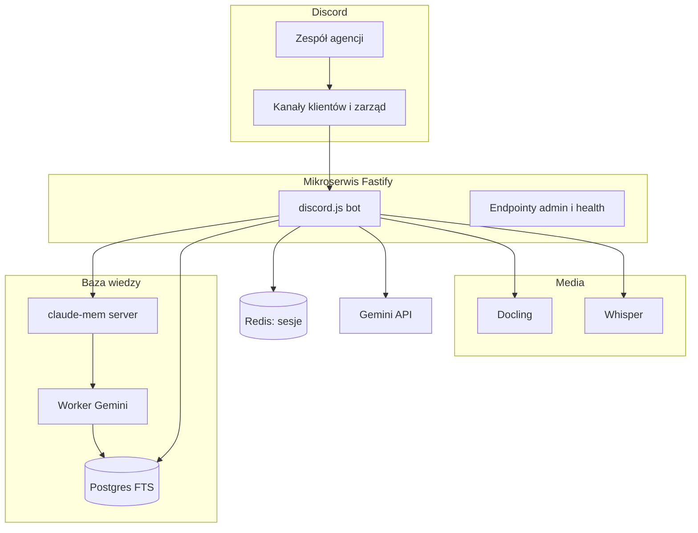

https://github.com/user-attachments/assets/5e1e8401-db24-43a7-b39d-06771f072b29


<h1 align="center">KO-RAG</h1>

<h3 align="center">Baza wiedzy agencji na Discordzie. Reakcja  :rag: zapisuje ważne wiadomości, komenda /rag odpowiada z linkami do źródeł.</h3>

<p align="center">
  
  
  
  
  
  
  
  
</p>

---

## Spis treści

- [O projekcie](#o-projekcie)
- [Screenshoty](#screenshoty)
- [Kod źródłowy](#kod-źródłowy)
- [Stack](#stack)
- [Funkcje](#funkcje)
- [Architektura](#architektura)
- [Statystyki](#statystyki)
- [Kontakt](#kontakt)

---

## O projekcie

W agencji marketingowej wiedza o klientach tonie w wątkach Discorda. Zastępstwo na spotkaniu albo pytanie "co klient napisał dwa tygodnie temu" oznaczało przewijanie setek wiadomości. Zespół nie zmieniał narzędzi: dalej pisał na Discordzie. Brakowało pamięci, której da się zapytać.

KO-RAG domyka tę lukę. Wiadomość oznaczona reakcją `:rag:`  trafia do bazy wiedzy: tekst, głosówki (zapisane jako tekst), dokumenty i screeny. Pytanie komendą `/rag` dostaje odpowiedź z cytowaniami: link do wiadomości, autor, kanał. Można dopytać w tej samej rozmowie przez 90 minut.

System działa na produkcji od maja 2026. Każdy kanał klienta widzi tylko swoje dane. Kanał zarządu pyta o całą agencję naraz. Bot stoi na serwerze, sam sprawdza zdrowie usług i wysyła alert e-mail, gdy coś pada.

---

## Screenshoty

| Zapis do bazy reakcją | Odpowiedź z linkami do źródeł |
|:---:|:---:|
|  |  |

| Dopytanie w tej samej rozmowie | Czuwanie nad usługami i alerty |
|:---:|:---:|
|  |  |

> **Nota:** screenshoty pochodzą z kanału testowego i pokazują fikcyjnego klienta (ACME SPORT). Żadne dane produkcyjne ani klientów agencji nie są publikowane.

---

## Kod źródłowy

Kod jest prywatny i poufny (system wewnętrzny agencji). To repo dokumentuje projekt: opis, architekturę i zrzuty działania.

---

## Stack

### Mikroserwis

```
Node.js 22 + Fastify 5      // API, webhooki, endpointy admin
TypeScript 5 (strict)       // 58 plików źródłowych, pełne typowanie
discord.js 14               // reakcje, slash commands, sesje follow-up
Zod                         // walidacja konfiguracji
```

### Baza wiedzy (RAG)

Sercem systemu jest open-source'owy [claude-mem](https://github.com/thedotmack/claude-mem): przyjmuje eventy, worker Gemini buduje z nich obserwacje, a Postgres FTS robi wyszukiwanie.

```
claude-mem server           // eventy, worker Gemini, obserwacje
PostgreSQL FTS              // wyszukiwanie + citation-join (link, autor, kanał)
Gemini API                  // odpowiedzi, rozbicie pytania na zapytania, function calling
Redis                       // sesje follow-up (TTL 90 min) i trybu agenta
```

### Media i dokumenty

```
faster-whisper (medium)     // transkrypcja głosówek
Docling                     // PDF, DOCX, XLSX i obrazy do markdown
Google Drive export         // linki do arkuszy i dokumentów
```

### Operacje

```
Docker Compose na VPS       // zero portów publicznych, health na 127.0.0.1
cron + SMTP2GO              // health check i alerty e-mail
Notion API                  // census klientów na kanale zarządu
Google Directory            // opcjonalny grafik spotkań
```

---

## Funkcje

### Zapis do bazy wiedzy

- **Reakcja `:rag:`**  - jedyna droga do bazy. Bez reakcji wiadomość nie wchodzi. Zespół wybiera, co warto zapamiętać
- **Cały wątek naraz** - reakcja na pierwszej wiadomości wątku zapisuje cały wątek (do 500 wiadomości). Nie trzeba klikać każdej odpowiedzi osobno
- **Aktualizacja po edycji** - poprawka treści albo zdjęcie reakcji odświeża albo usuwa zapis. Baza nie trzyma starych wersji
- **Załączniki** - dokumenty, obrazy, głosówki i linki z Dysku Google też wchodzą do bazy. Głosówka staje się tekstem, PDF i Excel też

### Odpowiedzi `/rag`

- **Cytowania** - przy kluczowych twierdzeniach widać link do wiadomości, autora i kanał. Pod odpowiedzią jest sekcja Źródła. Da się sprawdzić, skąd bot wziął informację
- **Szukanie po słowach kluczowych** - bot rozbija pytanie na kilka zapytań, szuka w bazie i składa odpowiedź z cytowaniami. Przewidywalna ścieżka, mało niespodzianek
- **Tryb z narzędziami** - przy trudniejszych pytaniach bot sam sięga po dodatkowe źródła (np. listę klientów w Notion). Gdy coś pójdzie nie tak, wraca do prostszego trybu
- **Dobór strategii do pytania** - pytanie o konkret, o big picture albo o zakres czasowy uruchamia inną ścieżkę wyszukiwania
- **Odmowa poza tematem** - pytanie spoza pracy agencji dostaje odmowę zamiast zmyślonej odpowiedzi
- **Dopytania** - historia rozmowy trzyma się 90 minut. Reset frazą albo komendą `/rag-reset`

### Wielu klientów, jeden bot

- **Izolacja kanałów** - odpowiedzi o kliencie A nigdy nie mieszają się z danymi klienta B
- **Kanał zarządu** - tu bot odpowiada z wiedzy całej agencji: lista klientów, grafik spotkań, przekrój tematów

### Utrzymanie na produkcji

- **Podgląd zdrowia** - widać, czy bot, Discord i monitorowane kanały działają
- **Dogrywanie historii** - da się dosłać stare wiadomości z kanału albo przeskanować cały serwer po reakcjach
- **Alerty e-mail** - co 5 minut system sprawdza usługi i pamięć. Przy niskim RAM restartuje je sam
- **Odporność na awarie** - bot przetrwał wielogodzinny outage Discorda bez ręcznej interwencji

---

## Architektura



---

## Statystyki

### Złożoność techniczna

| Metryka | Wartość |
|---|---|
| **Commity** | 145 (maj-sierpień 2026) |
| **Autorzy** | 1 |
| **Linie kodu TS** | 10 658 |
| **Pliki źródłowe TS** | 58 |
| **Komendy slash** | 2 |
| **Endpointy HTTP** | 4 |
| **Usługi Docker** | 4 (bot, redis, docling, whisper) + osobny stack claude-mem |
| **Monitorowane kanały** | 205 |
| **Zmienne konfiguracyjne** | 43 |

### Przegląd funkcji

| Kategoria | Najważniejsze |
|---|---|
| **Zapis** | reakcja, cały wątek, dokumenty, głosówki, Dysk |
| **Odpowiedzi** | cytowania, dwa tryby, dopytania |
| **Wielu klientów** | izolacja kanałów, widok zarządu |
| **Utrzymanie** | zdrowie usług, dogrywanie historii, alerty e-mail |

---

## Kontakt

| Platforma | Link |
|---|---|
| **WWW** | [kamilkaczmareksolutions.com](https://kamilkaczmareksolutions.com) |
| **GitHub** | [kamilkaczmareksolutions](https://github.com/kamilkaczmareksolutions) |
| **LinkedIn** | [Kamil Kaczmarek](https://www.linkedin.com/in/kamilkaczmareksolutions) |
| **Email** | [recruitment@kamilkaczmareksolutions.com](mailto:recruitment@kamilkaczmareksolutions.com) |

---

**KO-RAG** - pamięć agencji, która odpowiada z cytowaniami.

<p align="center"><em>Zbudował Kamil Kaczmarek</em></p>
